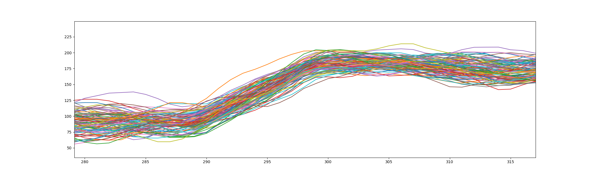

# Cryptography / Power Analysis

This is a write-up of my solution to these challenges from the [2023 picoCTF](index.md):

- Cryptography / [Power Analysis: Warmup](https://play.picoctf.org/practice/challenge/366) (200 Points)
- Cryptography / [Power Analysis: Part 1](https://play.picoctf.org/practice/challenge/364) (400 Points)
- Cryptography / [Power Analysis: Part 2](https://play.picoctf.org/practice/challenge/365) (500 Points)

## Background: AES Encryption
These three challenges cover breaking [AES](https://en.wikipedia.org/wiki/Advanced_Encryption_Standard)
encryption via [side-channel attacks](https://en.wikipedia.org/wiki/Side-channel_attack).
That means they do not directly attack a weakness in the encryption itself,
but rather in the way it is implemented in hard- or software.

I did not have any prior knowledge of this, so here are some resources I found useful while working on these challenges:
- Mike Pound explains the AES algorithm in a [Computerphile video](https://www.youtube.com/watch?v=O4xNJsjtN6E)
- LiveOverflow has a [YouTube video](https://www.youtube.com/watch?v=FktI4qSjzaE) about a similar challenge in the rhme2 CTF,
  where the process of an actual hardware attack can be seen
- LiveOverflow also refers to an [Introduction to Side-Channel Power Analysis](https://www.youtube.com/watch?v=OlX-p4AGhWs) by Colin O'Flynn,
  that goes into much more detail


## Power Analysis: Warmup (200)
> This encryption algorithm leaks a "bit" of data every time it does a computation. Use this to figure out the encryption key.
> Download the encryption program here encrypt.py. Access the running server with `nc saturn.picoctf.net [port]`.
> The flag will be of the format `picoCTF{<encryption key>}` where `<encryption key>` is 32 lowercase hex characters comprising the 16-byte encryption key being used by the program.

Let's first see how the interactive part works:

```
$ nc saturn.picoctf.net [port]
Please provide 16 bytes of plaintext encoded as hex: 64646464646464646464646464646464
leakage result: 10
```

The source code provided shows exactly the code that is run on the server.
We are dealing with a single round of AES encryption without any row and column mixing.
Additionally, the lowest bit of each output byte is leaked and they are summed up to give the `leakage result`.
The relevant part of the code is this function:

```python
leak_buf = []
def leaky_aes_secret(data_byte, key_byte):
    out = Sbox[data_byte ^ key_byte]
    leak_buf.append(out & 0x01)
    return out
```

To gather information, I generated a script that collects leakage results for different inputs:

```bash
echo -n "00000000000000000000000000000000 -> " >> test_results.log
echo "00000000000000000000000000000000" | nc saturn.picoctf.net [port] | rev | cut -d" " -f 1 | rev >> test_results.log
echo -n "00000000000000000000000000000001 -> " >> test_results.log
echo "00000000000000000000000000000001" | nc saturn.picoctf.net [port] | rev | cut -d" " -f 1 | rev >> test_results.log
[...]
echo -n "ff000000000000000000000000000000 -> " >> test_results.log
echo "ff000000000000000000000000000000" | nc saturn.picoctf.net [port] | rev | cut -d" " -f 1 | rev >> test_results.log
```

...much programming...

My script gives me four possible keys:
```
possible keys: ['c596206623ebf1acbe0aef4a14115dd9', 'c596206623ebf1acbe0aefa814115dd9', 'c596206623ebf1acbe0aef4a14555dd9', 'c596206623ebf1acbe0aefa814555dd9']
```
I could add more test inputs, to narrow it down further, but with four options, I can also just try all of them out. `picoCTF{c596206623ebf1acbe0aefa814555dd9}` is correct.

## Power Analysis: Part 1 (400)
> This embedded system allows you to measure the power consumption of the CPU while it is running an AES encryption algorithm. Use this information to leak the key via dynamic power analysis.
> Access the running server with `nc saturn.picoctf.net 59914`. It will encrypt any buffer you provide it, and output a trace of the CPU's power consumption during the operation. The flag will be of the format `picoCTF{<encryption key>}` where `<encryption key>` is 32 lowercase hex characters comprising the 16-byte encryption key being used by the program.

```
$ nc saturn.picoctf.net 64035
Please provide 16 bytes of plaintext encoded as hex: 0102030405060708090a0b0c0d0e0f00
power measurement result:  [114, ..., 240]
```
About 2666 data points are contained

Watching LiveOverflow video about similiar challenge in rhme2 CTF: https://www.youtube.com/watch?v=FktI4qSjzaE
Which refers to this introduction by Colin O'Flynn: https://www.youtube.com/watch?v=OlX-p4AGhWs

First, I generate 100 samples randomly and store them in the same format as the ones given for Part 2. I hope this will save time later.
For a first look, I then plot all traces on top of each other:


They seem to have the same structure, where the 10 rounds of 128-bit [AES](https://en.wikipedia.org/wiki/Advanced_Encryption_Standard) can be easily identified.

Taking a closer look at just one trace, there is a lot of noise that makes it hard to identify different sections:


Watching Colin O'Flynn's video, the low and high regions should be the charge and pre-charge phases:


He then analyses for a hypothetical key(-byte), how many output pins would be on high, after one round of SRA:


These numbers should then be correlated to the power measurement at some point in time. We don't need to know the exact point in time, since we can just use a sliding window and find the highest correlation in that


So the approach should be similar as in the "warm up" challenge:
- I pick a random secret (`00000000000000000000000000000000`)
- I loop through all option for one of the bytes and calculate the maximum correlation
- I fix this byte to the value that yielded the highest correlation
In the end I should be left with a very probable key.

Since I don't know the input to the second round of AES, it probably makes sense to limit my search to the first section of the trace. This should be contained in the range $290$ to $530$:



...writing lots of code...

My code loops over the least significant key byte first. To be sure nothing goes wrong, the correlation should increase in every step and the position should stay (roughly) the same:
```
best key so far: 000000000000000000000000000000b8 (pos=341, corr=0.34644252956173904)
best key so far: 000000000000000000000000000056b8 (pos=341, corr=0.3965694713687967)
best key so far: 00000000000000000000000000c356b8 (pos=341, corr=0.4700554645965293)
best key so far: 0000000000000000000000007ec356b8 (pos=341, corr=0.5382612157535783)
best key so far: 0000000000000000000000197ec356b8 (pos=341, corr=0.6255097369235134)
best key so far: 000000000000000000009f197ec356b8 (pos=341, corr=0.679049617718589)
best key so far: 0000000000000000004a9f197ec356b8 (pos=341, corr=0.7140452390952908)
best key so far: 00000000000000002b4a9f197ec356b8 (pos=341, corr=0.7621854578636492)
best key so far: 00000000000000c42b4a9f197ec356b8 (pos=341, corr=0.7652981560582679)
best key so far: 00000000000086c42b4a9f197ec356b8 (pos=341, corr=0.7730740526689681)
best key so far: 00000000000086c42b4a9f197ec356b8 (pos=341, corr=0.7730740526689681)
best key so far: 00000000000086c42b4a9f197ec356b8 (pos=341, corr=0.7730740526689681)
best key so far: 00000025000086c42b4a9f197ec356b8 (pos=341, corr=0.7910030914147077)
best key so far: 0000ad25000086c42b4a9f197ec356b8 (pos=341, corr=0.8019587247941974)
best key so far: 00eead25000086c42b4a9f197ec356b8 (pos=341, corr=0.8175977677434648)
best key so far: 2ceead25000086c42b4a9f197ec356b8 (pos=341, corr=0.8325054411773501)
```
This is not the correct flag. Also the two `0x00`-bytes next to each other make me suspicious. I might get stuck in a local minimum or on a noise fluctuation.
Doing the same thing again with a smoothed out trace (averaged over a flat window of width 5) and solving each byte independently:
```
Best key independent solve: 8a46f8604416e559a2d413513384be96
Best key low bytes first:   8af1ee6089f1711ea2d40dcb3384b496
Best key high bytes first:  8a46f8081d0d69fb1600130000cb9900
```
Trying a window with a more gaussian shape `[1, 2, 4, 6, 12, 6, 4, 2, 1]`:
```
Best key independent solve: 8a46f8601053e559a2d4130c9384be21
Best key low bytes first:   2567c67d6bc4e52fa2fc28cb33a9be21
Best key high bytes first:  8a46f8601d165d59340003c0e9160000
```
Solving independent seems to be the way to go, but this still does not solve the challenge.

...lots of debugging later...

I minimize the correlation first and then iterate the optimization, until it converges:
```
Minimize correlation first:  4281cec266ad91ccfa01f31c94bfbd16
Iteration 1:  aff2ce5e196e808ef4209286462a5034
Iteration 2:  b1fcce5e196eddeaf459928648e1b534
Iteration 3:  b1fcce5e196eddeaf45992864806cd34
Converged in 3 Iterations on: b1fcce5e196eddeaf45992864806cd34
```
`picoCTF{b1fcce5e196eddeaf45992864806cd34}` still doesn't work...
Don't start with minimizing?
```
Start point:  00000000000000000000000000000000
Iteration 1:  2567c67d6bc4e52fa2fc28cb33a9be21
Iteration 2:  2567c67d6bc4e52fa2fc73cb33a91f96
Converged in 2 Iterations on: 2567c67d6bc4e52fa2fc73cb33a91f96
```
No... Downloald 200 more traces? (also don't cumulate on first iteration, to check that position is consistent)
```
Start point: 00000000000000000000000000000000
best byte 0x0: 000000000000000000000000000000cb (pos=370, corr=0.24901) -> 000000000000000000000000000000cb
best byte 0x1: 0000000000000000000000000000e000 (pos=370, corr=0.26305) -> 0000000000000000000000000000e0cb
best byte 0x2: 000000000000000000000000003a0000 (pos=370, corr=0.2368) -> 000000000000000000000000003ae0cb
best byte 0x3: 00000000000000000000000059000000 (pos=370, corr=0.22447) -> 000000000000000000000000593ae0cb
best byte 0x4: 0000000000000000000000ca00000000 (pos=315, corr=0.24003) -> 0000000000000000000000ca593ae0cb
best byte 0x5: 000000000000000000008e0000000000 (pos=370, corr=0.28259) -> 000000000000000000008eca593ae0cb
best byte 0x6: 00000000000000000056000000000000 (pos=369, corr=0.24255) -> 000000000000000000568eca593ae0cb
best byte 0x7: 0000000000000000f400000000000000 (pos=315, corr=0.2313) -> 0000000000000000f4568eca593ae0cb
best byte 0x8: 000000000000004e0000000000000000 (pos=370, corr=0.25669) -> 000000000000004ef4568eca593ae0cb
best byte 0x9: 0000000000007a000000000000000000 (pos=369, corr=0.24441) -> 0000000000007a4ef4568eca593ae0cb
best byte 0xa: 00000000006b00000000000000000000 (pos=523, corr=0.21326) -> 00000000006b7a4ef4568eca593ae0cb
best byte 0xb: 000000004e0000000000000000000000 (pos=370, corr=0.27088) -> 000000004e6b7a4ef4568eca593ae0cb
best byte 0xc: 00000024000000000000000000000000 (pos=315, corr=0.2481) -> 000000244e6b7a4ef4568eca593ae0cb
best byte 0xd: 0000f800000000000000000000000000 (pos=315, corr=0.24481) -> 0000f8244e6b7a4ef4568eca593ae0cb
best byte 0xe: 00cf0000000000000000000000000000 (pos=315, corr=0.22732) -> 00cff8244e6b7a4ef4568eca593ae0cb
best byte 0xf: 39000000000000000000000000000000 (pos=372, corr=0.25069) -> 39cff8244e6b7a4ef4568eca593ae0cb
Iteration 1:  39cff8244e6b7a4ef4568eca593ae0cb
Iteration 2:  
Iteration 3:  
Converged in 3 Iterations on: 
```
Solve three times starting at random seeds:
...no! New strategy: Solve each byte independently with a set of different seeds and use the most common ones to combine them into a full key:
```
2023-03-27T23:30:25.077545
....................
Byte 0x0: b8 (5/20 = 25%)
Byte 0x1: 8e (6/20 = 30%)
Byte 0x2: 12 (5/20 = 25%)
Byte 0x3: b0 (5/20 = 25%)
Byte 0x4: 3f (9/20 = 45%)
Byte 0x5: 18 (2/20 = 10%)
Byte 0x6: cb (2/20 = 10%)
Byte 0x7: 9b (8/20 = 40%)
Byte 0x8: 09 (7/20 = 35%)
Byte 0x9: a9 (2/20 = 10%)
Byte 0xa: af (2/20 = 10%)
Byte 0xb: 55 (2/20 = 10%)
Byte 0xc: ad (6/20 = 30%)
Byte 0xd: 01 (5/20 = 25%)
Byte 0xe: 2b (5/20 = 25%)
Byte 0xf: 39 (4/20 = 20%)
best key: 392b01ad55afa9099bcb183fb0128eb8
```
`picoCTF{392b01ad55afa9099bcb183fb0128eb8}` was wrong.
This seems to work though... let it run over night...

```
Byte 0x0: b8 (10/32 = 31%)
Byte 0x1: 8e (3/32 = 9%)
Byte 0x2: 12 (4/32 = 12%)
Byte 0x3: b0 (7/32 = 21%)
Byte 0x4: 3f (11/32 = 34%)
Byte 0x5: 19 (3/32 = 9%)   -> differs
Byte 0x6: cb (7/32 = 21%)
Byte 0x7: 9b (11/32 = 34%)
Byte 0x8: 09 (9/32 = 28%)
Byte 0x9: a9 (4/32 = 12%)
Byte 0xa: 57 (3/32 = 9%)   -> differs
Byte 0xb: 7a (8/32 = 25%)   -> differs
Byte 0xc: ad (5/32 = 15%)
Byte 0xd: 01 (5/32 = 15%)
Byte 0xe: 4f (3/32 = 9%)   -> differs
Byte 0xf: 39 (5/32 = 15%)  
2023-03-28T02:01:11.242105  
best key: 394f01ad7a57a9099bcb193fb0128eb8
```
Re-running the differing bytes:
```
2023-03-28T07:01:33.716469
Byte 0x5: be (9/32 = 28%)
Byte 0xa: 57 (7/32 = 21%)
Byte 0xb: 7a (6/32 = 18%)
Byte 0xe: 2b (6/32 = 18%)
2023-03-28T07:22:41.001639
```
Let's try `picoCTF{392b01ad7a57a9099bcbbe3fb0128eb8}` -> It works!!!

## Power Analysis: Part 2 (500)
> This embedded system allows you to measure the power consumption of the CPU while it is running an AES encryption algorithm. However, this time you have access to only a very limited number of measurements.
> Download the power-consumption traces for a sample of encryptions traces.zip The flag will be of the format `picoCTF{<encryption key>}` where `<encryption key>` is 32 lowercase hex characters comprising the 16-byte encryption key being used by the program.

We only get 100 pre-made traces this time, so we can't choose our own plain-texts.

Should work with the same code from Part 1. Let it run with 500 seeds each while at work.
After 8h20 of running:
```
2023-03-28T07:38:58.003878
Byte 0x0: de (56/500 = 11%)  second best: 5b (22/500 = 4%)
Byte 0x1: 34 (64/500 = 12%)  second best: 6a (22/500 = 4%)
Byte 0x2: 9f (78/500 = 15%)  second best: 5b (17/500 = 3%)
Byte 0x3: 88 (60/500 = 12%)  second best: e5 (28/500 = 5%)
Byte 0x4: 1b (22/500 = 4%)  second best: 6d (21/500 = 4%)
Byte 0x5: 10 (45/500 = 9%)  second best: da (37/500 = 7%)
Byte 0x6: 5f (38/500 = 7%)  second best: d8 (22/500 = 4%)
2023-03-28T15:34:43.548434
2023-03-28T16:25:34.745361
Byte 0x7: 8d (7/100 = 7%)  second best: df (7/100 = 7%)
2023-03-28T16:41:01.381490
2023-03-28T16:44:26.938696
Byte 0x7: 81 (4/50 = 8%)  second best: 8d (3/50 = 6%)
Byte 0x8: d4 (6/50 = 12%)  second best: f9 (5/50 = 10%)
Byte 0x9: 0f (7/50 = 14%)  second best: c9 (3/50 = 6%)
Byte 0xa: 25 (4/50 = 8%)  second best: b6 (4/50 = 8%)
Byte 0xb: 17 (4/50 = 8%)  second best: ea (3/50 = 6%)
Byte 0xc: a2 (4/50 = 8%)  second best: 14 (3/50 = 6%)
Byte 0xd: e1 (3/50 = 6%)  second best: 50 (3/50 = 6%)
Byte 0xe: c4 (4/50 = 8%)  second best: 84 (3/50 = 6%)
Byte 0xf: a8 (5/50 = 10%)  second best: 40 (3/50 = 6%)
2023-03-28T17:53:23.143791
best key:  a8c4e1a2 17250fd4 8d5f101b 889f34de
sure ones: ^ ~   ~  ~   ^ ~  ^ ^ ~    ^ ^ ^ ^
```
Re-run uncertain ones:
```
2023-03-28T18:10:07.559749
Byte 0x4: f8 (3/80 = 3%)  second best: 43 (3/80 = 3%)
Byte 0x5: 10 (10/80 = 12%)  second best: 3a (5/80 = 6%)
Byte 0x8: d4 (10/80 = 12%)  second best: e7 (5/80 = 6%)
Byte 0xa: 25 (12/80 = 15%)  second best: b6 (6/80 = 7%)
2023-03-28T19:00:07.034259
2023-03-28T19:13:46.876277
Byte 0x4: 1b (7/80 = 8%)  second best: c2 (5/80 = 6%)
Byte 0xd: 3c (6/80 = 7%)  second best: 92 (4/80 = 5%)
2023-03-28T19:40:40.018833

best key:  a8c43ca2 17250fd4 8d5f101b 889f34de
sure ones: ^ ~ ~ ~  ~ ^ ^ ^  ^ ^ ^ ^  ^ ^ ^ ^
```
Trying `picoCTF{a8c43ca217250fd48d5f101b889f34de}` -> wrong!
More Re-runs:
```
2023-03-28T19:46:10.750401
Byte 0xb: 17 (3/40 = 7%)  second best: ea (2/40 = 5%)
Byte 0xc: a6 (3/40 = 7%)  second best: 5f (2/40 = 5%)
Byte 0xd: 3c (6/40 = 15%)  second best: 80 (2/40 = 5%)
Byte 0xe: a4 (4/40 = 10%)  second best: c4 (3/40 = 7%)
2023-03-28T20:11:50.810181
2023-03-28T20:14:16.072212
Byte 0xc: 0b (4/50 = 8%)  second best: a6 (4/50 = 8%)
2023-03-28T20:21:54.415205

best key:  a8c43ca6 17250fd4 8d5f101b 889f34de
sure ones: ^ ^ ^ ~  ~ ^ ^ ^  ^ ^ ^ ^  ^ ^ ^ ^
```
Trying:
- `picoCTF{a8c43ca617250fd48d5f101b889f34de}` -> correct!
