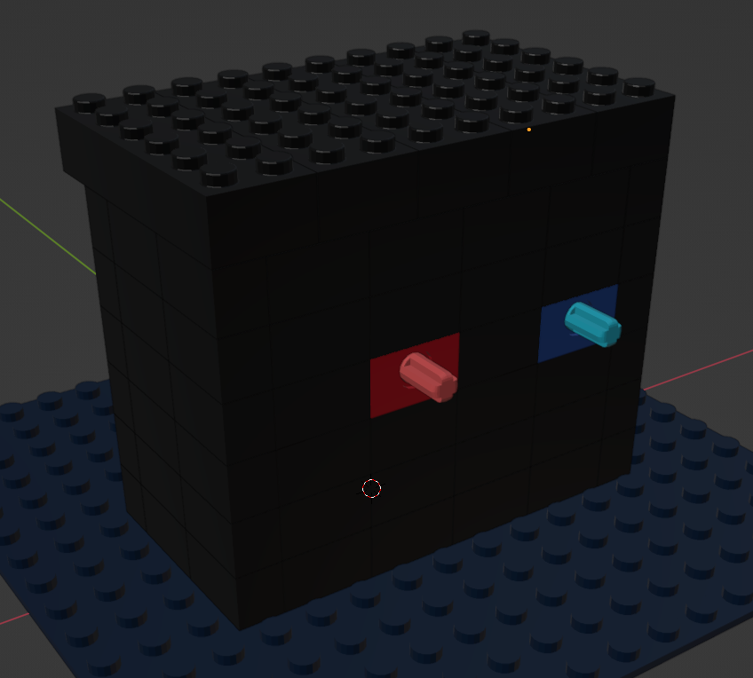
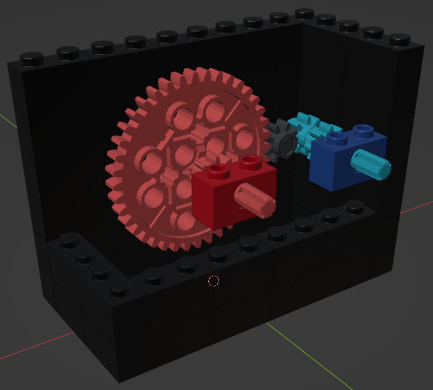
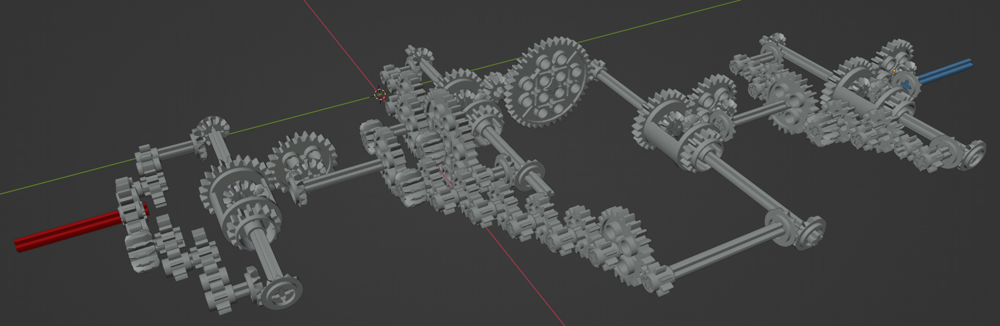
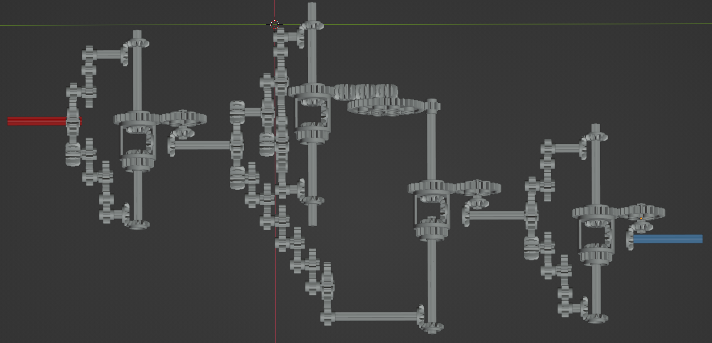
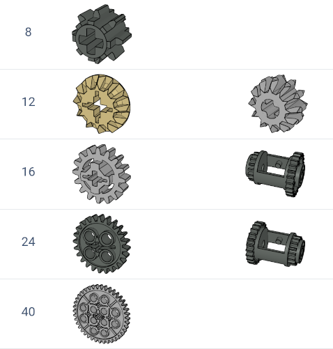
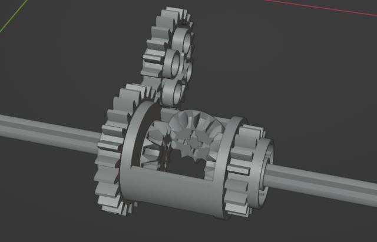
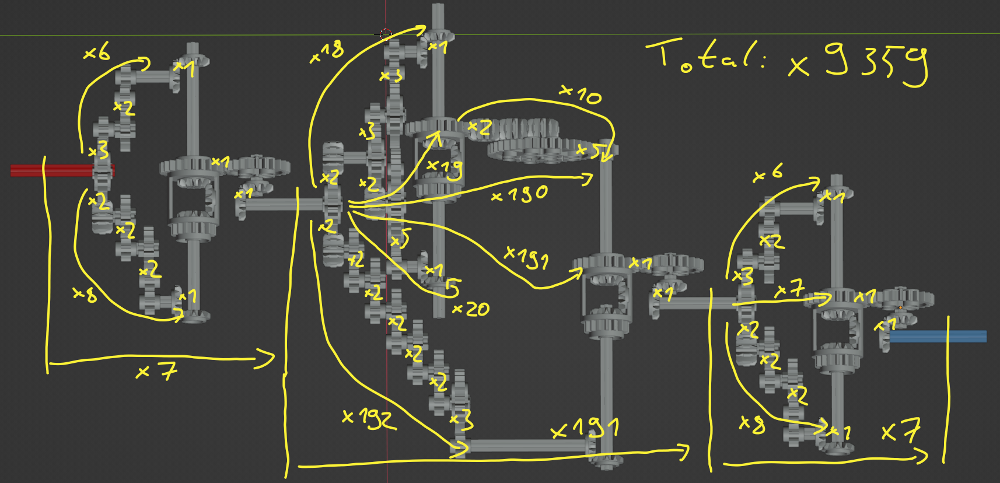

# Reverse Engineering / Virtual Machine

This is a write-up of my solution to these challenges from the [2023 picoCTF](/posts/2023_picoctf):

- Reverse Engineering / [Virtual Machine 0](https://play.picoctf.org/practice/challenge/385) (100 Points)
- Reverse Engineering / [Virtual Machine 1](https://play.picoctf.org/practice/challenge/386) (300 Points)

## Virtual Machine 0 (100)
> Can you crack this black box? We grabbed this design doc from enemy servers: Download. We know that the rotation of the red axle is input and the rotation of the blue axle is output. The following input gives the flag as output: Download.

The download is a zip-archive, which contains the file `Virtual-Machine-0.dae`.
I had to research what this file format is.
The `.dae`-suffix is used by [`collada`-files](https://en.wikipedia.org/wiki/COLLADA) that contain 3D-models.


I could import the file in [Blender](https://www.blender.org/)
which on first sight only shows a black box of lego bricks with the red and blue axle mentioned in the challenge description sticking out:



Deleting some of the bricks reveals the inner mechanism:



This is a rather simple mechanism.
The big red gear has 20 teeth, the two smaller ones both have 8, thus the gear ratio is `40:8:8 = 5:1`.
(Also the red and blue axle will turn in the same direction,
but that does not seem to be relevant for these challenges.)

The other downloadable file `input.txt` contains a 74 digit number.
If the red axle is turned that many times, the blue one will follow with 8 times the rotations.
I was not exactly sure what to do with the resulting number at first, but the simplest guess turned out to be correct:
The number can be directly transformed into bytes (as an unsigned integer) and interpreted as ASCII characters.

I solved it with this python code:
```python
from math import log, ceil
input_code = "39722847074734820757600524178581224432297292490103996093885484608048665625"
rotations_blue = int(input_code)*5
n_bytes_needed = ceil(log(rotations_blue, 2**8))
output_bytes = rotations_blue.to_bytes(length=n_bytes_needed, byteorder='big')
print(output_bytes.decode('ascii'))
```

Running this, prints the flag: `picoCTF{g34r5_0f_m0r3_XXXXXXXX}`

## Virtual Machine 1 (300)
> The enemy has upgraded their mechanical analog computer. Start an instance to begin.
> We grabbed this design doc from enemy servers: Download. We know that the rotation of the red axle is input and the rotation of the blue axle is output. Reverse engineer the mechanism and get past their checker program: `nc saturn.picoctf.net [port]`

There is again a 3D model to download, but before looking at that, let's see what kind of input is expected when connecting to the server:
```
$ nc saturn.picoctf.net [port]
If the input to the machine is 20170, what is the output?
Answer> 20170
20170
That's not correct.
You have to wait 360.0 seconds before trying again.
```

Starting a few instances and trying different answers, it seems that this time an integer is expected as the answer.
Also the input given in the question seems to be random for each attempt, so there is no room for guessing.

The 3D model is not hiding any details this time, but the mechanism is much more complex:





The challenge gave three hints:
1. The supporting structure for the machine has been removed from the given design doc.
2. Some gears are meshed strangely, such as tooth overlapping tooth. Consider such gears as meshed correctly.
3. Learn enough about gear ratios to abstract details from the design doc.

After reading the third one, I gave up my attempts to find software that can run a physics simulation of this model.
I'd have to calculate the gear ratio again like for the simple machine in the previous challenge.

On http://gears.sariel.pl/ I found an overview of 32 different types of Lego gears.
Here is a cropped down version of just the seven ones used in this challenge:



This list includes a [differential](https://en.wikipedia.org/wiki/Differential_(mechanical_device)),
which has one input axle on each side:



The body of the differential will turn with the average number of rotations of the two inputs.
This includes direction, so if one input does 1 rotation clockwise and the other input 1 rotation counter-clockwise,
the differential will not move at all.

With this information, it is a matter of going through the entire mechanism and determining all the gear ratios.
Luckily, they all turn out to be nice whole numbers:



To check my calculation (and prepare for the interactive part of the challenge),
I wrote this python script, which simulates the entire gear train:

```python
import sys
from fractions import Fraction as R
red_axis = int(sys.argv[1])
print(f"{red_axis=}")
diff_1_top = red_axis * R(24, 12) * R(16, 8) * R(16, 8)
diff_1_low = red_axis * R(24, 8) * R(16, 8)
diff_1 = (diff_1_top + diff_1_low) / 2
print(f"{diff_1=}")
diff_2_top = diff_1 * R(24, 12) * R(24, 12) * R(40, 8)
diff_2_low = diff_1 * R(24, 12) * R(24, 8) * R(24, 8)
diff_2 = (diff_2_top + diff_2_low) / 2
print(f"{diff_2=}")
diff_3_top = diff_1 * R(24, 12) * R(16, 8)**5 * R(24, 8)
diff_3_low = diff_2 * R(24, 12) * R(40, 8)
diff_3 = -1 * (diff_3_top + diff_3_low) / 2
print(f"{diff_3=}")
diff_4_top = diff_3 * R(24, 12) * R(16, 8) * R(16, 8)
diff_4_low = diff_3 * R(24, 8) * R(16, 8)
diff_4 = (diff_4_top + diff_4_low) / 2
print(f"{diff_4=}")
blue_axis = float(diff_4)
print(f"{blue_axis=}")
```

This confirms the overall ratio of 1:9359:

```
$ python solve.py 1
red_axis=1
diff_1=Fraction(7, 1)
diff_2=Fraction(133, 1)
diff_3=Fraction(-1337, 1)
diff_4=Fraction(-9359, 1)
blue_axis=-9359.0
```

Used with the input of the interactive session, this finally yields the flag:

```
$ nc saturn.picoctf.net [port]
If the input to the machine is 15750, what is the output?
Answer> 147404250     
147404250
That's correct!
picoCTF{m0r3_g34r5_3g4d_XXXXXXXX}
```
